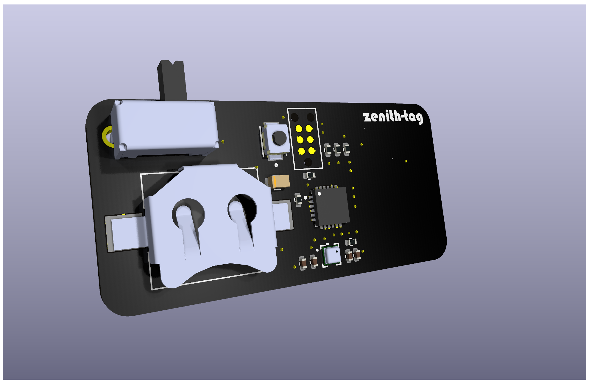
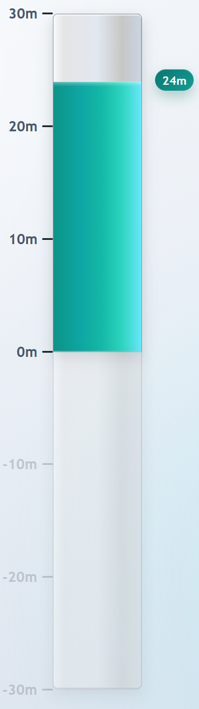

# Zenith Tag - NFC Flight Altitude Logger

Zenith Tag is a compact embedded altitude logger built around the NXP NHS3100 and Bosch BMP388.
It captures relative max flight altitude from barometric pressure and writes the result as an NFC URI record, so the value can be read by a phone with no wired interface.

<table align="center">
	<tr>
		<td align="center" valign="middle" width="74%">
			
		</td>
		<td align="center" valign="middle" width="26%">
			
		</td>
	</tr>
	<tr>
		<td align="center"><sub>PCB Layout</sub></td>
		<td align="center"><sub>Altitude Meter UI</sub></td>
	</tr>
</table>

## What This Repository Contains

This repository is split into three main parts:

- `hw/`: KiCad design files, custom libraries, 3D models, and datasheets
- `sw/`: NHS3100 firmware project (MCUXpresso style) and source modules
- `web/`: Vue 3 web app served from the NFC URI that visualises the recorded altitude

## High-Level Features

- BMP388 pressure and temperature acquisition over I2C
- Full BMP388 calibration and compensation implementation in firmware
- Relative altitude computation using barometric equation
- Push-button controlled measurement session
- LED status signaling (idle, actively measuring, and error indication)
- NFC Type-2 compatible NDEF URI payload written to NHS3100 shared memory
- Web app landing page that parses the height query parameter and renders an animated altitude bar

## Repository Structure

### Hardware (`hw/`)

- Main KiCad project files:
	- `hw/hw.kicad_sch`
	- `hw/hw.kicad_pcb`
	- `hw/hw.kicad_pro`
- Custom part libraries:
	- `hw/footprints/` and `hw/hw.pretty/` for footprint definitions
	- `hw/symbols/` for custom symbol definitions
	- `hw/models/` for STEP 3D models
- Engineering references:
	- `hw/datasheets/` for component PDFs and reference image files
	- `hw/calculations/NFC-Antenna-Calculation.xlsx` for antenna-related design calculations

### Firmware (`sw/`)

- Application source tree: `sw/src/`
- Core application entry point: `sw/src/main.c`
- Board and low-level init:
	- `sw/src/board/inc/board.h`
	- `sw/src/board/src/board.c`
- Functional components:
	- `sw/src/components/button/`
	- `sw/src/components/led/`
	- `sw/src/components/pressure/`
	- `sw/src/components/nfc/`
- Device/library code:
	- `sw/src/lib/lib_chip_nss/`
	- `sw/src/lib/startup/`

### Web App (`web/`)

A Vite + Vue 3 single-page app hosted at the NFC URI target.

- Entry point: `web/src/App.vue`
- Reads the `height` query parameter from the URL (e.g. `?height=12.34`)
- Renders an animated vertical bar showing the recorded altitude, clamped to ±30 m
- Styled with Bulma

To run locally:

```sh
cd web
npm install
npm run dev
```

To build for production:

```sh
npm run build
```

## Firmware Behavior

The main loop in `sw/src/main.c` follows this sequence:

1. Initialize board/peripherals and BMP388.
2. Wait for button press to start a measurement session.
3. Collect a short pre-takeoff pressure baseline (`PRE_TAKEOFF_MEASUREMENTS`).
4. Repeatedly sample pressure while session is active, tracking the minimum pressure reached.
5. End session with a second button press.
6. Compute signed relative altitude from both `pressure_min` and `pressure_max` versus baseline pressure, choose the larger magnitude, then apply a `-0.50 m` offset.
7. Store the measured value over NFC as a URI query parameter: `https://example.com/?height=<value>`.

Current default timing constants are defined in `sw/src/config.h`:

- Debounce: 5 ms
- Measurement interval: 20 ms
- LED toggle during active measurement: 500 ms
- Baseline sample count: 10

## Hardware/Firmware Interface Summary

- MCU: NXP NHS3100 (integrated NFC + Cortex-M0+)
- Pressure sensor: Bosch BMP388 on I2C address `0x77`
- Key pin usage in firmware:
	- `PIO0_1`: button input
	- `PIO0_2`: status LED output
	- `PIO0_4`: I2C SCL
	- `PIO0_5`: I2C SDA

## NFC Output Format

The NFC module (`sw/src/components/nfc/nfc.c`) writes a compact NDEF URI record into NHS3100 NFC shared memory.
The payload encodes a URL in this form: `https://example.com/?height=<value>`.

Example payload:

`https://example.com/?height=12.34`

## Build and Flash Notes

This project is structured like an MCUXpresso/Eclipse embedded project.

- Recommended workflow:
	- Import the `sw/` project into MCUXpresso IDE
	- Build using IDE-managed toolchain/configuration
	- Program/debug using LinkServer and the provided launch configuration
- Command-line makefiles are auto-generated and may contain absolute machine-specific paths in linker/library references.

## Included References

- Component datasheets and design references: `hw/datasheets/`

## Typical Use

1. Manufacture the PCB.
2. Configure GUI_BASE_URL in `config.h` with the URL of the web application that should open after the NFC tag is scanned.
3. Build and flash the firmware to the NHS3100 board.
4. Power on the tag and wait for idle-ready indication.
5. Press the button to start logging.
6. Press the button again to stop logging.
7. Tap a phone to the NFC antenna area — the phone opens the stored URI in a browser.
8. The web app reads the `height` query parameter and displays the recorded altitude.

---